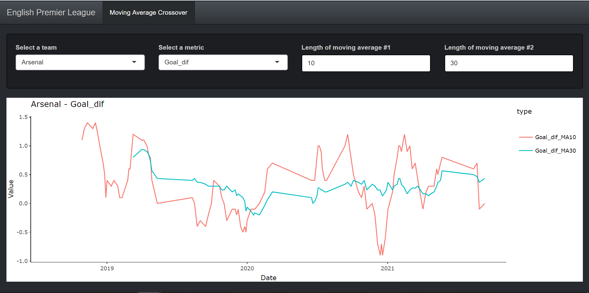

<!-- README.md is generated from README.Rmd. Please edit that file -->

# English Premier League Moving Average Crossover

<!-- badges: start -->
<!-- badges: end -->

## Overview

The EPL\_MA\_Crossover repository hosts the code for my English Premier
League Moving Average Crossover Shiny app.

#### App Description

The Shiny app currently only displays one tab, namely the ‘Moving
Average Crossover’ tab, which shows the moving average crossover plot of
the selected team, metric, and moving averages lengths.



## Project Structure

This project is an R Shiny app which contains:

-   [setup.R](https://github.com/MoAnd/EPL_MA_Crossover/blob/master/setup.R):
    Script containing packages and other setup materials.
-   [global.R](https://github.com/MoAnd/EPL_MA_Crossover/blob/master/global.R):
    Script for the global environment in the Shiny application.
-   [ui.R](https://github.com/MoAnd/EPL_MA_Crossover/blob/master/ui.R):
    Script for the user interface in the Shiny application.
-   [server.R](https://github.com/MoAnd/EPL_MA_Crossover/blob/master/server.R):
    Script for the server logic in the Shiny application.
-   [R/](https://github.com/MoAnd/EPL_MA_Crossover/tree/master/R):
    Directory of the main functions used in the project.

#### Documentation

The main functions in this repo is documented with `roxygen2`-style
docstrings. Please use the
[docstring](https://cran.r-project.org/web/packages/docstring/vignettes/docstring_intro.html)
packages to view the documentation directly in RStudio’s help pane like
so:

``` r
library(docstring)
docstring(create_crossover_plot)
```

#### Package Management

This project use the [renv](https://rstudio.github.io/renv/index.html)
package for dependency management. After cloning you may run
`renv::restore()` to re-install all of the packages as declared in the
renv lockfile.

## Resources

Football data is obtained directly from
[football-data.co.uk](https://www.football-data.co.uk).
